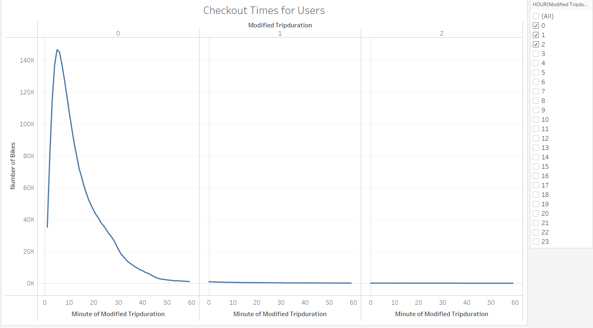
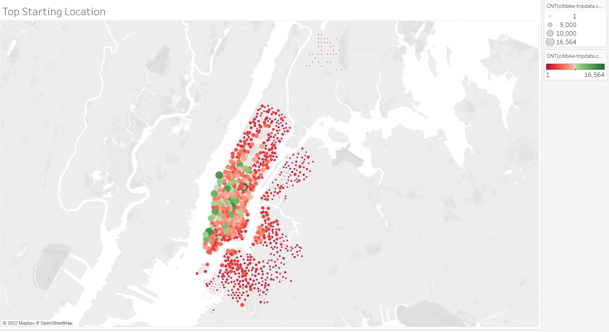
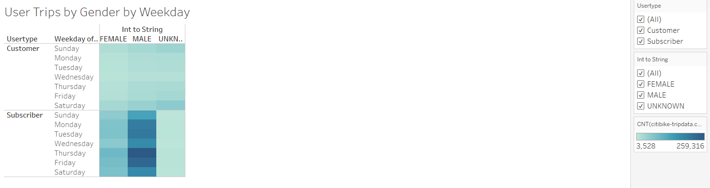
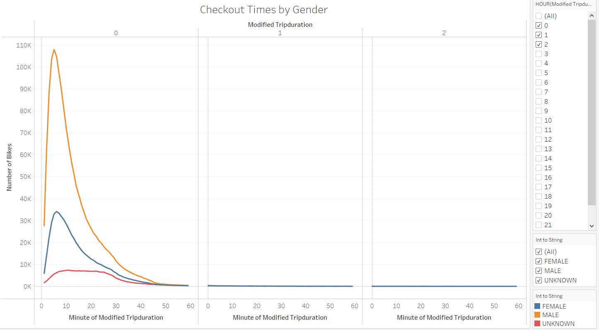
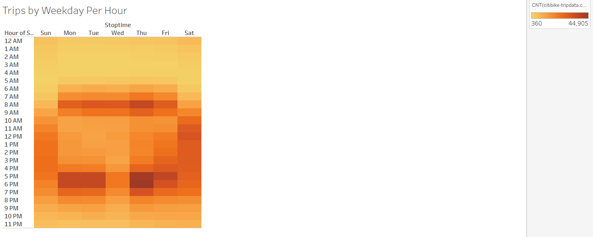
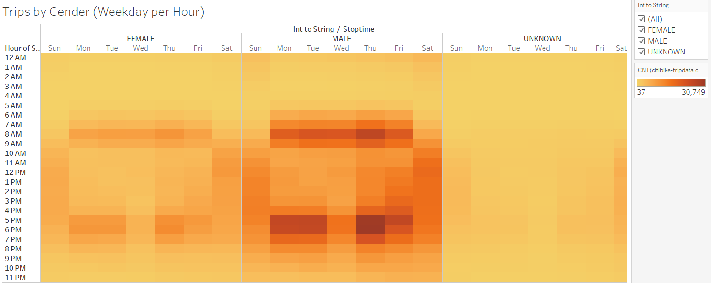

# Bikesharing

## Overview

    The purpose of this analysis was to create a presentation that would convince investors that a bike-sharing program in 
    Des Moines is a solid business propsoal. A few of the visualizations inculded in the presentation include: 
    
         * Show the length of time that bikes are checked out for all riders and genders.
                
         * Show the number of bike trips for all riders and genders for each hour of each day of the week.
                
         * Show the number of bike trips for each type of user and gender for each day of the week.
         
## Results
"This graph visualizes the length of time that bikes are checked out for all riders."

## Summary
    According to the data gathered for this analysis it is clear that males dominate a large number of 
    bike riders in NYC. On average a bike ride will last about 5 minutes per ride. It can be observed from 
    the "User Trips by Gender by Weekday" chart that Thursday's and Friday's are the most popular days
    to checkout bikes. The idea gathered here is quite extensive, however; I would create two more 
    visualizations to find out what times the bike are being checkout at and the affect the NYC weather 
    has on the number of users. 

[link to dashboard]("https://public.tableau.com/app/profile/bryan.rojas/viz/NYCCitiBikeBreakdown_16485018230240/NYCCitiBikeBreakdown?publish=yes")
